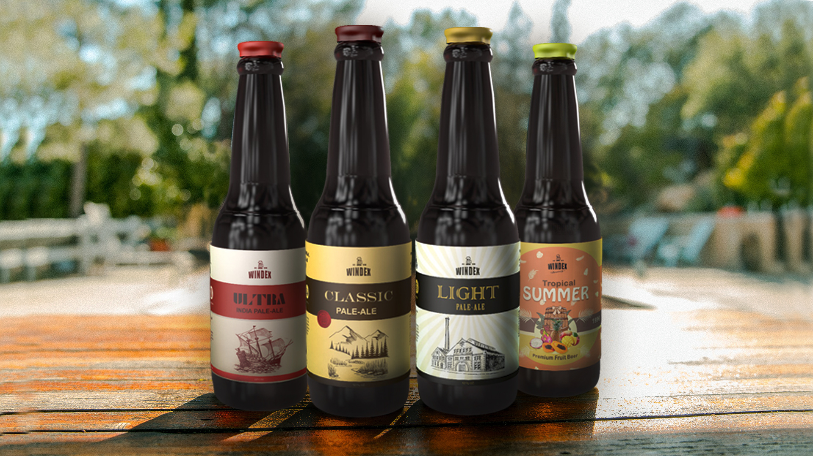

# Web Design & Development Project for The Windermere Brewery

For more information visit:
http://arkoroy.ca/windex.html

## Description

Create some UI on the products / promotions page that can be used to load relevant
information from an array. Think about interactivity, microinteractions / transactions, user
experience, etc.

Your team can use a combination of advertisements or promotions and product features.
Create an interactive graphic / icon for each (create at least 3) and load content onto the
page when the user requests that information. Consider scalability and responsive design
considerations for your graphics, and choose your format(s) accordingly.

As an example, consider a “2 for 1” promo. Create a “Click for promo details” button or
graphic; clicking on that graphic should retrieve the content for that promo from an array
and add or replace existing content on the page.

Alternatively, create “hot spots” on your product images and reveal exciting information
about a given feature on a click. As an example, you could reveal information about the
health benefits of beer-scented baby wipes using a clickable graphic overlaid on your
product image.

# MIT License

Copyright (c) 2021 Arko Roychowdhury

Permission is hereby granted, free of charge, to any person obtaining a copy
of this software and associated documentation files (the "Software"), to deal
in the Software without restriction, including without limitation the rights
to use, copy, modify, merge, publish, distribute, sublicense, and/or sell
copies of the Software, and to permit persons to whom the Software is
furnished to do so, subject to the following conditions:

The above copyright notice and this permission notice shall be included in all
copies or substantial portions of the Software.

THE SOFTWARE IS PROVIDED "AS IS", WITHOUT WARRANTY OF ANY KIND, EXPRESS OR
IMPLIED, INCLUDING BUT NOT LIMITED TO THE WARRANTIES OF MERCHANTABILITY,
FITNESS FOR A PARTICULAR PURPOSE AND NONINFRINGEMENT. IN NO EVENT SHALL THE
AUTHORS OR COPYRIGHT HOLDERS BE LIABLE FOR ANY CLAIM, DAMAGES OR OTHER
LIABILITY, WHETHER IN AN ACTION OF CONTRACT, TORT OR OTHERWISE, ARISING FROM,
OUT OF OR IN CONNECTION WITH THE SOFTWARE OR THE USE OR OTHER DEALINGS IN THE
SOFTWARE.
